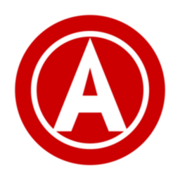

# 🚩✊ Liberchat — La Commune Numérique

  

« Pour l'autogestion, la solidarité et la liberté numérique. Un chat libre, par et pour le peuple. »

**Anticapitaliste · Logiciel libre · Anarcho-syndicaliste**

---

## 🌐 Annuaire des projets Liberchat

### 💬 [Liberchat (Core)](https://github.com/Liberchat/Liberchat)  
Le cœur de l'application de messagerie libre, sécurisée et fédératrice.

---

### 🤖 [Liberchat Android](https://github.com/Liberchat/Liberchat-android)  
Version mobile pour Android – pour rester libre même dans ta poche.

---

### 🐳 [Liberchat Docker (expérimental)](https://github.com/Liberchat/Liberchat-docker)  
Déploiement facile et rapide avec Docker. Idéal pour l'auto-hébergement.

---

### 🐧 [Liberchat Linux](https://github.com/Liberchat/Liberchat-Linux)  
Version native pour les systèmes GNU/Linux.

---

### 🪟 [Liberchat Windows 10/11](https://github.com/Liberchat/Liberchat-win10-11)  
Compatibilité assurée avec les systèmes Windows récents.

---

### 🍏 [Liberchat macOS](https://github.com/Liberchat/Liberchat-macOS)  
Conçu aussi pour les utilisateurs de macOS.

---

### 🎨 [Liberchat Thèmes](https://github.com/Liberchat/Liberchat-th-mes)  
Collection de thèmes personnalisés pour personnaliser votre interface.

---

### 🏠 [Liberchat YunoHost](https://github.com/Liberchat/liberchatserver_ynh)  
Package YunoHost pour auto-hébergement simplifié .

---
  
### Documentation
- [Guide utilisateur](https://github.com/Liberchat/Liberchat/blob/Liberchat6.1.16/docs/Home.md)
- [FAQ](https://github.com/Liberchat/Liberchat/wiki/FAQ)
- [Support](mailto:contact@unionlibertaireanarchiste.org)

---

## 🏴 Pourquoi un chat libertaire militant ?

> « La communication libre est une arme. Organisons-nous, partageons, résistons ! »

- Aucune hiérarchie, pas de chef : tout le monde a le même pouvoir.
- Respect de la vie privée : pas de tracking, pas de pub, pas de collecte de données.
- Code ouvert, transparent, modifiable : fork, partage, autogestion.
- Solidarité et entraide : entraide technique et humaine, soutien communautaire.
- Hébergement décentralisé possible : pour ne dépendre d'aucun géant du web.

---

**Fait par et pour la communauté, dans l'esprit de la Commune numérique.**
